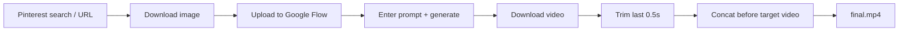

# l_automation — Pinterest → Google Flow → Video Splice

Local Mac automation that:

1. Sources a reference image, either by generating a random UGC model with
   Nano Banana Pro (Gemini image API) or by scraping Pinterest.
2. Feeds it to Google Flow / Veo with a text prompt and generates a video.
3. Downloads the generated video.
4. Trims the last ~0.5s off the generated clip.
5. Splices it onto the **beginning** of another (target) video.

It uses [Playwright](https://playwright.dev) for browser automation and
`ffmpeg`/`ffprobe` for deterministic video editing.



## Generation backends

Video can be generated two ways, selected by `flow.backend`:

- **`api`** (recommended) — calls Veo directly via the **Gemini API**. Headless,
  fast, reliable, parallelizable; no anti-bot fighting or brittle UI selectors.
  Pay-per-second. Needs a `GEMINI_API_KEY`.
- **`browser`** — drives the Google Flow web UI with Playwright. Uses your Flow
  subscription credits, but depends on the UI staying stable and a logged-in
  session.

Note: the Gemini API exposes `veo-3.1-generate-preview` and
`veo-3.1-fast-generate-preview`. "Veo 3.1 Lite" is a **Vertex-only** tier, so on
the Gemini API the closest match is **Fast** (`apiModel`, the default). The
image sourcing and the ffmpeg trim/splice are identical for both backends.

## Image sources

The reference image is selected by `imageSource.mode`:

- **`openai`** (default) — generates a fresh, random UGC-style selfie of a woman
  with OpenAI **`gpt-image-2`** (state-of-the-art, most photorealistic; older
  options: `gpt-image-1.5`, `gpt-image-1`). Same randomized prompt as below;
  portrait `1024x1536` at `high` quality by default. Needs `OPENAI_API_KEY`.
- **`nanobanana`** — generates a fresh, random UGC-style selfie of a
  woman with **Nano Banana Pro** (`gemini-3-pro-image-preview`) via the Gemini
  API. No browser, no scraping, and every run is a different believable person
  (age / ethnicity / hair / setting / lighting / outfit are randomized). Costs
  ~$0.13 per image and needs the same `GEMINI_API_KEY`. Set
  `imageSource.nanoBanana.promptOverride` to use a fixed prompt instead of the
  randomized one.
- **`pinterest`** — searches/downloads from Pinterest (uses the browser,
  headless on the api backend) and never reuses the same pin twice.

You can always bypass both with `--image <path>` to feed a local file.

## Requirements

- Node.js 20+ (tested on 23)
- `ffmpeg` and `ffprobe` on your `PATH` (`brew install ffmpeg`)
- For the **openai** image source: an OpenAI API key (https://platform.openai.com/api-keys)
- For the **api** backend / **nanobanana** images: a Gemini API key (https://aistudio.google.com/apikey)
- For the **browser** backend: a Google account with Flow access
- A Pinterest account (for image sourcing, unless you pass `--image`)

## Setup

```bash
npm install
npx playwright install chromium   # only needed for Pinterest / browser backend
cp config.example.json config.json
```

Edit `config.json` (see options below).

### API backend (recommended)

Set your key in the environment, then run:

```bash
export GEMINI_API_KEY="your-key-here"
npm run run
```

### Browser backend

Set `flow.backend` to `"browser"`, then log in once:

```bash
npm run login
```

This opens a real browser for Pinterest and Google Flow. Log in manually; the
session is stored in the persistent profile (`.browser-profile/`) and reused on
later runs. Re-run it whenever sessions expire.

(Pinterest sourcing always uses the browser, so a one-time Pinterest login via
`npm run login` is useful even with the api backend — or skip it with `--image`.)

## Running

```bash
npm run run            # produce one video
npm run loop           # keep producing until you stop it (Ctrl+C)
```

Each finished video is named and filed by date automatically:

```
output/2026-06-15/2026-06-15_132501_girl-ugc.mp4
```

The name is `<date>_<time>_<slug>`, where the slug comes from your
`pinterest.query` (or the prompt). All videos for a given day land in
`output/<YYYY-MM-DD>/`, so you can find a particular date quickly.

### Continuous mode

Set `run.count` in `config.json` (use `0` for "until stopped"), or use flags:

```bash
npm run run -- --count 5            # produce 5 videos back-to-back
npm run run -- --loop --interval 30 # forever, waiting 30s between runs
```

In a loop, each iteration advances the Pinterest result index
(`resultIndex + iteration`) so every run uses a different image. A failed
iteration is logged (with a screenshot) and the loop moves on.

### Useful flags

- `--config <path>` — use a different config file.
- `--image <path>` — skip Pinterest and feed a local image to Flow.
- `--count <n>` — produce N videos (overrides `run.count`).
- `--loop` — produce videos until you stop the process.
- `--interval <seconds>` — wait between iterations (overrides `run.delaySeconds`).
- `--generated-video <path>` — skip the browser entirely and only run the
  trim + splice step on an existing clip. Great for testing the editing stage.

```bash
# Only do the editing step on a clip you already have:
npm run run -- --generated-video ./downloads/clip.mp4
```

### Captions (burned onto the generated clip)

Captions are added to the generated clip **before** splicing. The displayed
words are your **exact** dialogue (no AI guessing the text) — they're pulled
from the `Dialogue: '...'` portion of `flow.prompt` (or set `captions.dialogue`
explicitly). Timing comes from a local Whisper transcription aligned to that
exact script; if Whisper isn't set up, timing is distributed evenly across the
clip (approximate but always works).

Enable/configure under `captions` in `config.json`:

| Key | Meaning |
| --- | --- |
| `captions.enabled` | Turn caption burn-in on/off. |
| `captions.dialogue` | Exact caption text. Empty = extract from the prompt. |
| `captions.wordsPerGroup` | Words shown on screen at once (UGC pop style). |
| `captions.upperCase` | UPPERCASE the captions. |
| `captions.position` | `"middle"` (TikTok center) or `"bottom"`. |
| `captions.verticalPosition` | Exact placement as a fraction from top (0 = use preset, e.g. 0.72 = lower third). |
| `captions.fontName` / `fontSize` | Font (0 = auto-size from height). Montserrat ships in `fonts/`. |
| `captions.primaryColor` / `outlineColor` / `outlineWidth` | Styling. |
| `captions.highlightCurrentWord` | Karaoke: recolor the active word as it's spoken. |
| `captions.highlightColor` | Fill color for the active word. |
| `captions.timingEngine` | `"auto"` / `"faster-whisper"` / `"whisper.cpp"` / `"even"`. |
| `captions.timingOffsetSec` | Shift all captions earlier/later (seconds). |
| `captions.fasterWhisperPython` / `fasterWhisperModel` | faster-whisper venv + model. |
| `captions.whisperBinary` / `whisperModel` | whisper.cpp CLI + model (fallback). |

Captions use **Montserrat** (bundled in `fonts/`, loaded via libass `fontsdir`),
show several words at once, and **highlight the current word** as it's spoken
(timing from Whisper). Long groups wrap automatically to stay on-screen.

**Timing engine** (`captions.timingEngine`, default `"auto"`):

1. **`faster-whisper`** (recommended, most accurate) — cross-attention word
   timestamps so the highlight lands on each word exactly as it's spoken. Set up
   a small Python venv once:

   ```bash
   python3.11 -m venv .venv-whisper
   .venv-whisper/bin/pip install faster-whisper
   ```

   It downloads its model (`base.en`) on first run. Configured via
   `fasterWhisperPython` and `fasterWhisperModel`.

2. **`whisper.cpp`** (fallback) — coarser word timing from the `whisper-cli`
   binary (`brew install whisper-cpp` + a `ggml-*.bin` model in `whisperModel`).

3. **`even`** — no transcription; distribute words evenly (always works).

`"auto"` uses faster-whisper if present, else whisper.cpp, else even. Use
`captions.timingOffsetSec` to nudge all captions earlier/later if needed.

### Never reusing a Pinterest image

Every pin the bot uses is recorded by its unique image hash in
`.state/seen-pins.json`. On each run it skips any pin already in that list and
scrolls to load more results until it finds a fresh one, so it never picks the
same image twice — even across separate runs, loops, or days.

To allow reuse again (start fresh), delete the state file:

```bash
rm .state/seen-pins.json
```

### Organizing existing videos

If you have loose `.mp4` files (e.g. older finals or downloads) to sort into
per-day folders by their modification date:

```bash
npm run organize                       # tidy loose files in output/
npm run organize -- --source ./downloads  # import from another folder
```

## Campaign presets

`config.json` ships with ready-made campaign presets under `campaigns[]`. Each
preset bundles a `vertical`, an audience `angle`, a `bodyVideo` to splice after
the generated hook, and a set of persona `variants` (news reporter, podcast
host, insider, peer story) with their own spoken `hooks` and top-card
`bubbleHooks`. Pick one in the web panel, or pass `--campaign <id>` on the CLI.

Current presets:

| Campaign id | Vertical | Audience angle |
| --- | --- | --- |
| `va-loans-veterans` | VA loans / veteran grants | Veterans with DD214 paperwork |
| `bathroom-remodel-seniors` | Bathroom remodel / walk-in showers | Seniors wanting a safer bathroom |
| `debt-seniors` | Debt relief / consolidation / credit-card / tax debt | Seniors & retirees on a fixed income |
| `debt-teachers` | Debt relief / consolidation / credit-card / tax debt | Underpaid teachers & school staff |
| `debt-union-workers` | Debt relief / consolidation / credit-card / tax debt | Union & blue-collar workers |
| `debt-nurses` | Debt relief / consolidation / credit-card / tax debt | Nurses & healthcare workers |
| `debt-veterans` | Debt relief / consolidation / credit-card / tax debt | Veterans (general relief, **not** a VA payout) |

The five **Debt** presets all expect a body clip at **`./assets/debt-body.mp4`**
(set per campaign via `bodyVideo`). Add that file before running them, or point
`bodyVideo` at an existing asset. The copy is written to stay compliant — it uses
"may qualify", "check your options", and "could lower your payment" rather than
promising guaranteed approvals or exact dollar amounts.

## Ad-library spy (research → suggest → regenerate)

A research subsystem that watches competitors on the **Meta Ad Library**, finds
the ads they look like they're **scaling**, figures out the **vertical**, and
surfaces ranked **suggestions** — and only regenerates after **you approve**.

```mermaid
flowchart LR
  WL["Whitelisted Pages"] --> Crawl["Crawl Meta Ad Library"]
  Crawl --> Score["Score: active × run-days × active copies"]
  Score --> Classify["Classify vertical (OpenAI)"]
  Classify --> Suggest["Ranked suggestions per vertical"]
  Suggest -->|you approve| DL["Download winner"]
  DL --> Tx["Transcribe (OpenAI)"]
  Tx --> Hooks["Draft fresh hook variations"]
  Hooks --> Campaign["Create campaign"]
  Campaign --> Gen["Queue normal generation pipeline"]
```



### How "scaling" is inferred

Meta's public Ad Library doesn't expose spend, so a winner is inferred from
public signals: the ad is **still active**, has been **running a long time**, and
has **many active near-duplicate copies** (advertisers duplicate winners across
ad sets when they scale). Thresholds live under `spy` in `config.json`
(`minRunDays`, `minCopies`).

### Using it (web panel)

1. Log into Facebook once so the crawler can read the Ad Library:
   ```bash
   npm run login
   ```
2. Start the control panel and open the **Spy** tab:
   ```bash
   npm run web
   ```
3. **Whitelist** the advertisers to track. For each, paste any of:
   - a full Ad Library URL (best — contains `view_all_page_id`),
   - a numeric Meta page id, or
   - a page name (used as a keyword search).
4. Click **Crawl now**. Watch the live log; when it finishes, **Suggestions**
   appear grouped by detected vertical, each with its evidence (days running,
   active copies, score) and a link to the original ad on Meta.
5. For a suggestion you like, you have two regeneration options:
   - **Hook + body** — pick a **body video** + count. It downloads the winner,
     transcribes it, drafts fresh (non-copy) hook variations, creates a campaign,
     and queues hook clips spliced in front of your body video.
   - **Remake full video** — recreates the *entire* ad end-to-end (no body clip
     needed). It downloads the winner, transcribes it, splits the script into
     ~7-second segments (same flow, original wording), generates one consistent
     persona, generates a captioned Veo clip per segment, and stitches them into
     one full-length video. Capped by `spy.fullRemakeMaxSegments` (each segment
     is one Veo request, so it uses more of your daily quota).
   - **Dismiss** hides ones you don't want.

### Using it (CLI)

```bash
npm run spy          # crawl all whitelisted pages once and rebuild suggestions
```

Approval (download + transcribe + campaign + queue) happens from the web panel.

### Notes & limitations

- You must be logged into Facebook (via `npm run login`); the Ad Library gates
  results behind a session and is anti-bot, so crawls degrade gracefully and
  save a screenshot to `artifacts/` when a page can't be read.
- DOM scraping of the Ad Library is best-effort; selectors are text-anchored
  ("Library ID", "Started running on") to survive layout changes, but Meta can
  still change things. The exact winner **video** is resolved at approval time
  by opening that single ad and capturing its `.mp4` from the network.
- Classification, transcription, and hook drafting use `OPENAI_API_KEY`.
- Whitelist, captured ads, and suggestions persist in `.state/spy/`. Downloaded
  winners land in `downloads/spy/`. Only track advertisers/creatives you have
  the right to research, and only regenerate content you're allowed to use.
- The persistent Chrome profile can only be open in one process at a time, so
  crawls, winner downloads, Pinterest sourcing, and full remakes are serialized
  behind a single browser lock. If you ever see "profile is already in use",
  close any Chrome window opened from `.browser-profile/` and retry.

## Configuration (`config.json`)

| Key | Meaning |
| --- | --- |
| `imageSource.mode` | `"openai"`, `"nanobanana"`, or `"pinterest"`. |
| `imageSource.openai.model` | OpenAI image model id (`gpt-image-2`, `gpt-image-1.5`, `gpt-image-1`). |
| `imageSource.openai.size` | `"auto"`, `"1024x1024"`, `"1024x1536"`, or `"1536x1024"`. |
| `imageSource.openai.quality` | `"low"`, `"medium"`, `"high"`, or `"auto"`. |
| `imageSource.openai.promptOverride` | Fixed prompt; empty = randomized UGC woman. |
| `imageSource.nanoBanana.model` | Gemini image model id (`gemini-3-pro-image-preview`). |
| `imageSource.nanoBanana.aspectRatio` | Image aspect ratio, e.g. `"9:16"`. |
| `imageSource.nanoBanana.imageSize` | `"1K"`, `"2K"`, or `"4K"`. |
| `imageSource.nanoBanana.promptOverride` | Fixed prompt; empty = randomized UGC woman. |
| `pinterest.query` | Search term used when no `imageUrl` is set. |
| `pinterest.imageUrl` | If set, download this image directly (skips search). |
| `pinterest.resultIndex` | Which search result to pick (0-based). |
| `flow.backend` | `"api"` (Gemini API) or `"browser"` (Flow web UI). |
| `flow.url` | Google Flow URL (browser backend). |
| `flow.prompt` | Generation prompt (both backends). |
| `flow.generationTimeoutMs` | How long to wait for generation (default 10 min). |
| `flow.model` | Veo model name to pick in Flow's UI (browser backend). |
| `flow.mode` | `"Ingredients"` or `"Frames"` (browser backend). |
| `flow.aspectRatio` | `"9:16"` or `"16:9"` (both backends). |
| `flow.apiModel` | Gemini API model id (api backend), e.g. `veo-3.1-fast-generate-preview`. |
| `flow.resolution` | `"720p"` or `"1080p"` (api backend). |
| `video.targetVideo` | The clip the generated video is spliced **in front of**. |
| `video.outputDir` | Base folder; finals are written to `<outputDir>/<date>/`. |
| `video.trimSeconds` | Seconds cut from the **end** of the generated clip (default `0.5`). |
| `browser.headless` | Run without a visible window (keep `false` for login). |
| `browser.profileDir` | Persistent browser profile (stores logins). |
| `browser.downloadDir` | Where downloads land. |
| `browser.slowMoMs` | Slow down actions for debugging. |
| `run.count` | How many videos to produce per invocation (`0` = until stopped). |
| `run.delaySeconds` | Seconds to wait between iterations in a loop. |
| `spy.enabled` | Turn the ad-library research subsystem on/off. |
| `spy.country` | Ad Library country filter, e.g. `"US"`. |
| `spy.maxAdsPerPage` | Max ads to capture per tracked page each crawl. |
| `spy.scrollRounds` | How many times to scroll results to lazy-load more ads. |
| `spy.minRunDays` / `spy.minCopies` | Scaling thresholds: active AND (≥ minRunDays OR ≥ minCopies copies) = winner. |
| `spy.suggestionsPerVertical` | Top suggestions surfaced per detected vertical. |
| `spy.classifierModel` | OpenAI chat model for vertical classification + hook drafting. |
| `spy.transcribeModel` | OpenAI transcription model used on an approved winner. |
| `spy.regenerateCount` | Default number of videos queued when a suggestion is approved. |
| `spy.autoCrawlMinutes` | Continuous tracking: re-crawl whitelisted pages every N minutes (`0` = manual only). The web server runs this in the background. |
| `spy.fullRemakeMaxSegments` | Max ~8s segments when remaking a FULL ad end-to-end. Each segment is one Veo request (caps cost/quota). |

## How the video step works

The generated clip and the target can have different resolutions, frame rates,
and audio. To make the join robust and lossless:

1. `ffprobe` reads both clips. The **target's** resolution/fps becomes the
   canonical output format.
2. The generated clip is trimmed (`-t duration-trimSeconds`), scaled+padded to
   the output geometry, set to the output fps, and given a silent audio track
   if it has none.
3. The target is normalized the same way.
4. The two normalized files are joined with the ffmpeg `concat` **filter** in a
   single re-encode pass (generated first), with `+faststart`. This produces one
   continuous stream so players don't skip the first segment.

## Reliability / human-in-the-loop

Pinterest and Google Flow are not stable APIs, so the automation degrades
gracefully instead of failing hard:

- **Login bootstrap** (`npm run login`) keeps auth manual and persistent.
- **Multiple selector strategies** for each Flow step (file input → file
  chooser → manual).
- **Manual checkpoints**: if a step can't be driven automatically (login,
  CAPTCHA, a changed button), the run pauses and asks you to do it in the
  browser, then press Enter.
- **Download detection**: if auto-download fails, it watches `downloadDir` for
  a new, fully-written video file.
- **Failure screenshots**: saved to `artifacts/` on errors and key fallbacks.
- **Configurable timeouts** for generation and downloads.

## Notes & limitations

- Only use Pinterest images you have the rights to use.
- If Google Flow changes its UI, the selectors in `src/flow.ts` may need
  tweaking; the manual checkpoints keep runs working in the meantime.
- Blob/stream video URLs can't always be fetched directly; in that case the
  tool falls back to a real download click or the manual download watcher.

## Project layout

```
src/
  config.ts          # load + validate config.json
  logger.ts          # tiny colored logger
  utils.ts           # fs helpers, sleep, manual-pause, download watcher
  browser.ts         # persistent Chromium context + screenshots
  bootstrap-login.ts # one-time manual login helper
  openai-image.ts    # openai source: random UGC model via gpt-image-1
  nanobanana.ts      # nanobanana source: random UGC model via Gemini image API
  pinterest.ts       # search / select / download image
  flow.ts            # browser backend: Flow upload → prompt → generate → download
  veo-api.ts         # api backend: Veo via Gemini API → poll → download
  captions.ts        # whisper-timed, script-exact UGC captions burned via ffmpeg
  seen.ts            # persistent "already used" pin store (no repeats)
  video.ts           # ffprobe/ffmpeg trim + splice
  index.ts           # CLI orchestrator (single run + continuous loop)
  organize.ts        # sort loose .mp4 files into output/<date>/ folders
  spy.ts             # ad-library research: crawl → score → suggest → approve
  spy-store.ts       # persistent whitelist / captured ads / suggestions (.state/spy/)
  meta-ad-library.ts # Meta Ad Library crawler + winner-video downloader
  spy-classify.ts    # vertical classification, transcription, hook drafting, segment split (OpenAI)
  full-remake.ts     # recreate an ENTIRE competitor ad: segments → per-clip Veo → stitch
```
